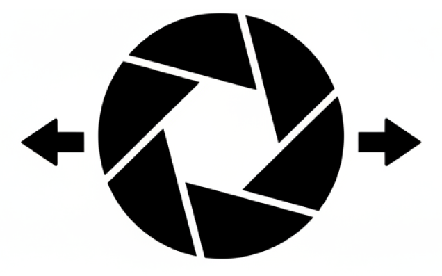
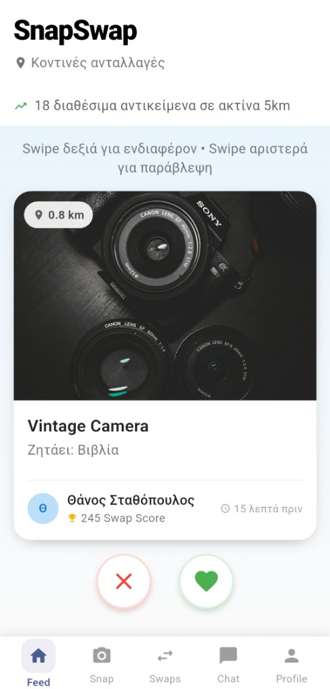
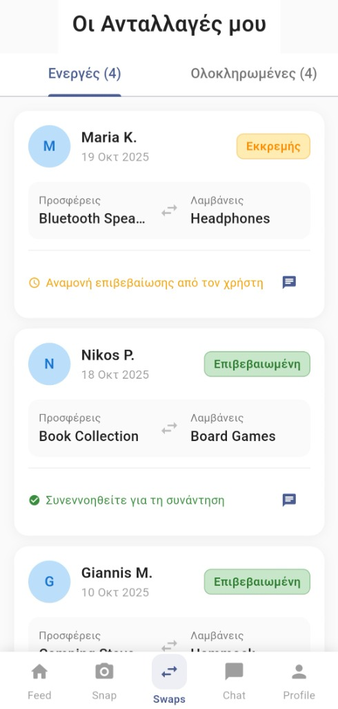
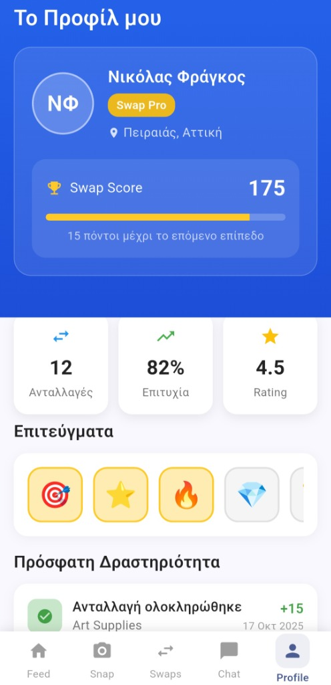

<p align="center">
  
</p>

<h1 align="center">SnapSwap</h1>
<h3 align="center"><em>Real-Time Swap Network</em></h3>

<p align="center">
  «Snap a photo and swap it for something you want — in seconds.»
</p>

<p align="center">
  
  
  
  
</p>

---

## 📖 About

**SnapSwap** is a social, real-time item-swapping mobile application. Take a photo of an item you no longer need and instantly see swap proposals from nearby users who have something you might want. Confirm the exchange with a swipe gesture, earn **Swap Score** points, and build your personal swap network — all without spending a single cent.

The app was designed with a strong emphasis on **Human-Computer Interaction (HCI)** principles, prioritizing an accessible, engaging, and highly usable interface.

---

## 📸 Screenshots

<p align="center">
  
  &nbsp;&nbsp;&nbsp;
  
  &nbsp;&nbsp;&nbsp;
  
</p>

### Feed Screen (left)

The **Feed** is the heart of SnapSwap. It displays items available for swap from nearby users within a configurable radius (e.g., 5 km). Each item card shows a photo, the item name, what the owner is looking for in return, the owner's Swap Score, distance, and how long ago it was posted. Users browse items using an intuitive **Tinder-style swiping interface** — swipe right to express interest, swipe left to skip.

### Swaps Screen (center)

The **Swaps** screen tracks all of a user's swap activity. It is organized into two tabs: **Active** (ongoing swaps) and **Completed** (past swaps). Each swap card displays the other user's name, the date, what each party is offering and receiving, and the current status of the swap — *Pending* (Εκκρεμής), *Confirmed* (Επιβεβαιωμένη), or *Completed*. Users can also open a chat to coordinate the physical meetup for the exchange.

### Profile Screen (right)

The **Profile** screen is the user's personal dashboard. It showcases the user's name, location, trust level badge (e.g., "Swap Pro"), and their **Swap Score** — a gamified reputation metric that increases with every successful swap. The screen also displays key statistics (total swaps, success rate, user rating), unlocked **achievements** (badges for milestones), and a chronological feed of **recent activity**.

---

## ✨ Key Features

| Feature | Description |
|---|---|
| 🔄 **Swipe-to-Swap Feed** | Browse nearby items with an intuitive card-swiping interface. Swipe right to show interest, left to pass. |
| 📸 **Camera Integration** | Snap a photo of any item you want to swap using the in-app camera — no external uploads needed. |
| 📍 **GPS-Based Discovery** | Automatically discover available items from users near you, with live real-time data updates. |
| 🏆 **Swap Score & Gamification** | Earn reputation points for every successful swap. Higher scores unlock greater trustworthiness and visibility. |
| 🤝 **Gesture-Based Confirmation** | Accept a swap proposal with a swipe gesture accompanied by haptic feedback — no buttons needed. |
| 💬 **In-App Chat** | Coordinate meetup details with your swap partner directly within the app. |
| 🏅 **Achievements & Badges** | Unlock achievement badges as you hit milestones in your swapping journey. |
| 📊 **Personal Stats** | Track your total swaps, success rate, and community rating on your profile. |

---

## 🧩 Innovation Axes

The application was designed around three key innovation axes:

### Axis 1 — Human-Centric Computing
- **User Profile with Swap Score**: Personalized profiles adapt swap suggestions based on the user's history. The gamified Swap Score system incentivizes engagement and builds trust within the community.

### Axis 2 — Interaction with the Physical World
- **Camera-Based Item Registration**: Users register items through the device camera, leveraging the phone's vision capabilities to bridge the physical and digital worlds.
- **Gesture Confirmation with Haptic Feedback**: Instead of traditional buttons, users confirm swaps through a swipe gesture with haptic feedback, creating a more natural and satisfying interaction.

### Axis 3 — Connectivity
- **GPS-Based Nearby User Discovery**: The app locates available items within a close radius and displays swap proposals dynamically in real time.

---

## 🛠 Tech Stack

| Technology | Purpose |
|---|---|
| [Flutter](https://flutter.dev/) | Cross-platform UI framework |
| [Dart](https://dart.dev/) | Programming language |
| [Provider](https://pub.dev/packages/provider) | State management |
| [SQLite (sqflite)](https://pub.dev/packages/sqflite) | Local database |
| [Geolocator](https://pub.dev/packages/geolocator) | GPS location services |
| [Image Picker](https://pub.dev/packages/image_picker) | Camera & gallery access |
| [Flutter Card Swiper](https://pub.dev/packages/flutter_card_swiper) | Swipe card UI component |
| [SharedPreferences](https://pub.dev/packages/shared_preferences) | Persistent key-value storage |

---

## 🚀 Getting Started

### Prerequisites

- [Flutter SDK](https://docs.flutter.dev/get-started/install) (≥ 3.0.0, < 4.0.0)
- Android Studio or VS Code with Flutter/Dart plugins
- An Android device or emulator

### Installation

```bash
# Clone the repository
git clone https://github.com/your-username/snapswap.git
cd snapswap

# Install dependencies
flutter pub get

# Run the app
flutter run
```

---

## 👥 User Groups

| User Group | Description |
|---|---|
| **Casual Users** | Want to swap items easily, quickly, and without money. |
| **High-Trust Users** (high Swap Score) | Frequent participants who enjoy greater credibility and trust in the system. |

The app serves both groups by providing different levels of trustworthiness based on their Swap Score and activity history.

---

## 👨‍💻 Team — Group 90

| Name | Registration No. |
|---|---|
| Athanasios Stathopoulos | el22869 |
| Grigorios Stamatopoulos | el22039 |
| Nikolaos Dionysios Fragkos | el22028 |

---

## 🎓 Academic Context

This project was developed as the term project for the **Human-Computer Interaction (HCI)** course at the **School of Electrical and Computer Engineering (ECE)**, **National Technical University of Athens (NTUA)**.